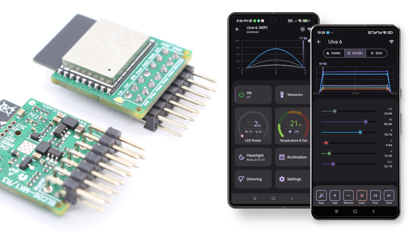
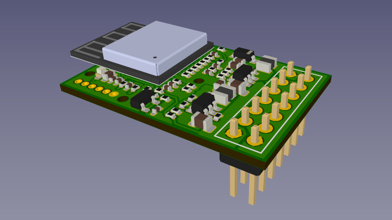
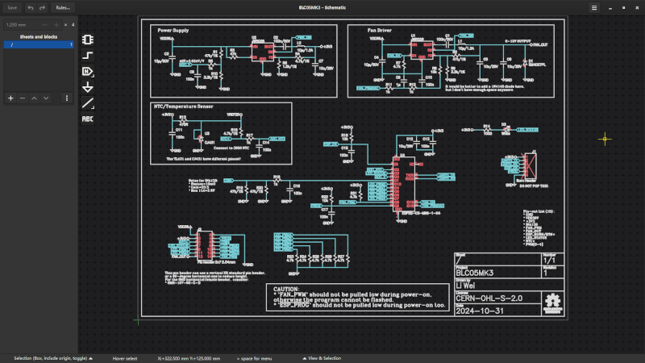
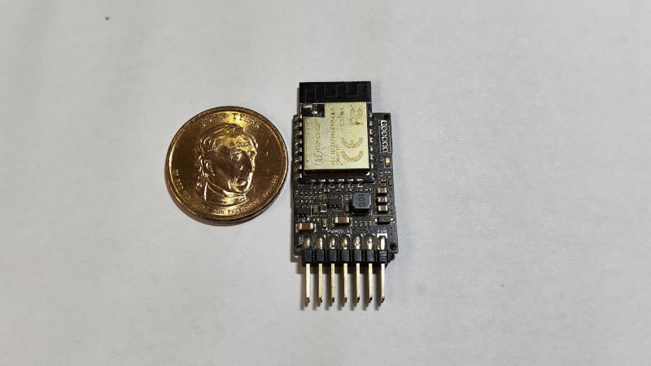
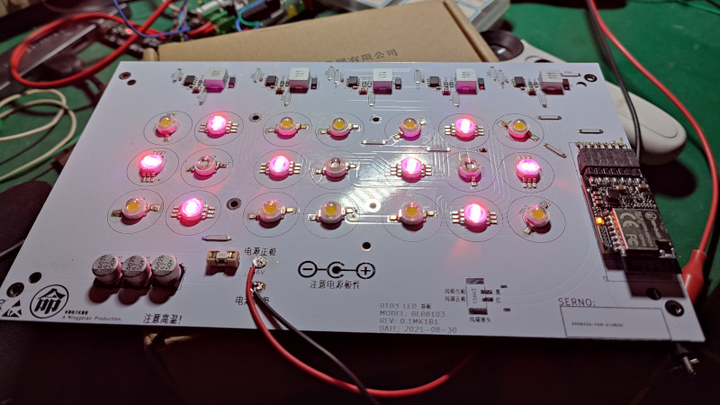
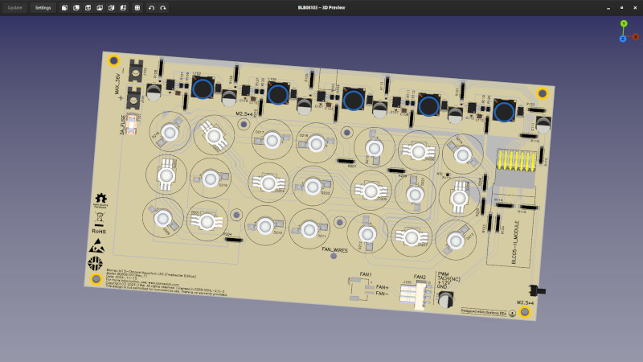
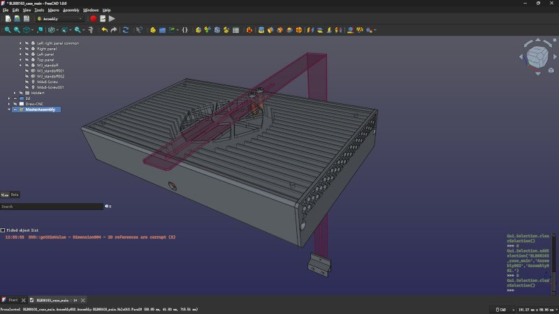

# A Based Open Source WiFi Aquarium LED DIY Kit

English | [中文](README.zh.md)

---

Borneo-IoT project is a commercial-grade, highly customizable open-source smart WiFi aquarium LED PWM controller module and mobile App.
More than that, this project also includes a 57W 6-color channel LED product as reference design.

For more information, please visit the project's website: [www.borneoiot.com](https://www.borneoiot.com).

PDF versions of the hardware schematics, datasheets and BoM can be found in [`hw/datasheets`](hw/datasheets).

If you like this project, please don't forget to give it a star. Thank you!

## Features

- **Full Stack Open Source**
    - Core board & 6-channel 57W LED lamp reference design (Schematic/PCB) using [Horizon EDA](https://horizon-eda.org)
    - Complete firmware based on [ESP-IDF](https://idf.espressif.com/) framework
    - Flutter mobile app with full source code

- **Modular Hardware Design**
    - Compact core board (2×3.5cm) for easy integration
    - Reference schematics for custom PCB implementations

- **Component-based Firmware**
    - Multi-ESP32 family support (ESP32/ESP32-C3/C5) via unified board definitions
    - Zephyr RTOS-like driver architecture with hardware abstraction
    - CoAP + CBOR protocol stack for multi-device support (lamps, pumps, sensors)

- **Rich Functionality**
    - 6-channel PWM controller with zero peripheral components
    - Graphical sunrise/sunset dimming with soft-start
    - SNTP time sync & PID-controlled cooling
    - Python API client & demo scripts
    - Optional INA139 current monitoring

- **Cost-effective Solution**
    - ESP32-C3/ESP32 MCUs with standard components
    - Integrated driver for basic/PWM cooling fans
    - Pin-header friendly for DIY integration

- **Production-ready System**[^1]
    - Wireless OTA firmware updates
    - Automated production tools:
        - Batch programming & QA testing
        - Product parameter configuration

- **Field-proven**
    - The prototype of this controller and LED driver has been running stably on my own planted tank for years
    - Extensible architecture (ongoing pump/pH monitor development)

[^1]: The open-source project does not provide mass production-related fixtures and software.

## Demo Pictures & Videos

### Demo Short Video:

### Pictures

|    LED Controller Module Appearance |    LED LED Controller Module Schematic |
|------------------------------------------|------------------------------------------ |
|    LED Controller - Old Prototype |    Aluminum PCB - Old Prototype |
|    Aluminum PCB Appearance |    Reference Design Lamp Appearance[^2] |

[^2]: The enclosure was manually measured and modeled by me after purchasing it from a friend, therefore, I regret that the design cannot be made public. If there is significant interest, I can redesign it.

## Project Status

### Hardware & Firmware

**Beta**：The firmware is full functionality and stability, but some minor features are still not quite perfect.

### Mobile App

**Pre-Beta**：All major functions have been completed and are operational, but minor functions such as setting the time zone still need to be implemented, and the stability also requires further polishing.

## Roadmap

Checkout the [milestones](https://github.com/oldrev/borneo/milestones) to get a glimpse of the upcoming features and milestones.

## Directory Structure

- `client/`: Mobile app source code
- `fw/`: Firmware source code
    - `scripts`: Related Python scripts, including the device Python client library
    - `cmake`: CMake scripts
    - `components`: Common ESP-IDF component source code
    - `lyfi`: LED controller firmware-related source code
    - `doser`: Dosing pump firmware-related source code (under development)
- `hw/`: Circuit design source files
    - `blc05mk3`: 5-channel LED controller core board design
    - `blc05mk3-horizontal`: 5-channel LED controller core board with horizontal pin headers
    - `blb08103`: 5-channel 63W LED lamp aluminum substrate design
    - `3d-models`: Exported STEP format 3D models of the core board
    - `datasheets`: The hardware specifications in PDF format[^3]
- `tools/`: Related scripts and tools

[^3]: Since the datasheets are based on templates from my other products, the source file will not be provided in this repository.

## Getting Started

Please check out the [online documentation](https://docs.borneoiot.com/getting-started).

## Contribution

Please read [CONTRIBUTING.md](.github/CONTRIBUTING.md) for more details.

If you want to support the development of this project, you could consider buying me a beer.

## Issues, Feedback & Support

We welcome your feedback! If you encounter any issues or have suggestions, please open an [issue](https://github.com/oldrev/borneo/issues).

- Website：[www.borneoiot.com](https://www.borneoiot.com)
- Online documentation：[docs.borneoiot.com](https://docs.borneoiot.com)
- GutHub Discussions: [github.com/oldrev/borneo/discussions](https://github.com/oldrev/borneo/discussions)
- Author's e-mail: [oldrev@gmail.com](mailto:oldrev@gmail.com)
- Borneo-IoT Discord Server: [discord.gg/GgH45vjX](https://discord.gg/GgH45vjX)

## License

### Software & Firmware

The software and firmware in this project is dual-licensed under the GNU General Public License version 3 or later (GPL-3.0+) and a proprietary license. You can find the full text of the GPL-3.0 license in the [LICENSE](LICENSE) file.

### Hardware

The hardware design in this project is licensed under the CERN Open Hardware Licence Version 2 - Strongly Reciprocal (CERN-OHL-S-2.0). You can find the full text of the license in the [LICENSE-HARDWARE](LICENSE-HARDWARE) file.

#### Proprietary Licensing

In addition to the GPL-3.0 license, I also offer proprietary licensing options for those who wish to use this software in proprietary products.

If you are interested in obtaining a proprietary license, please contact me at [oldrev@gmail.com](mailto:oldrev@gmail.com).

