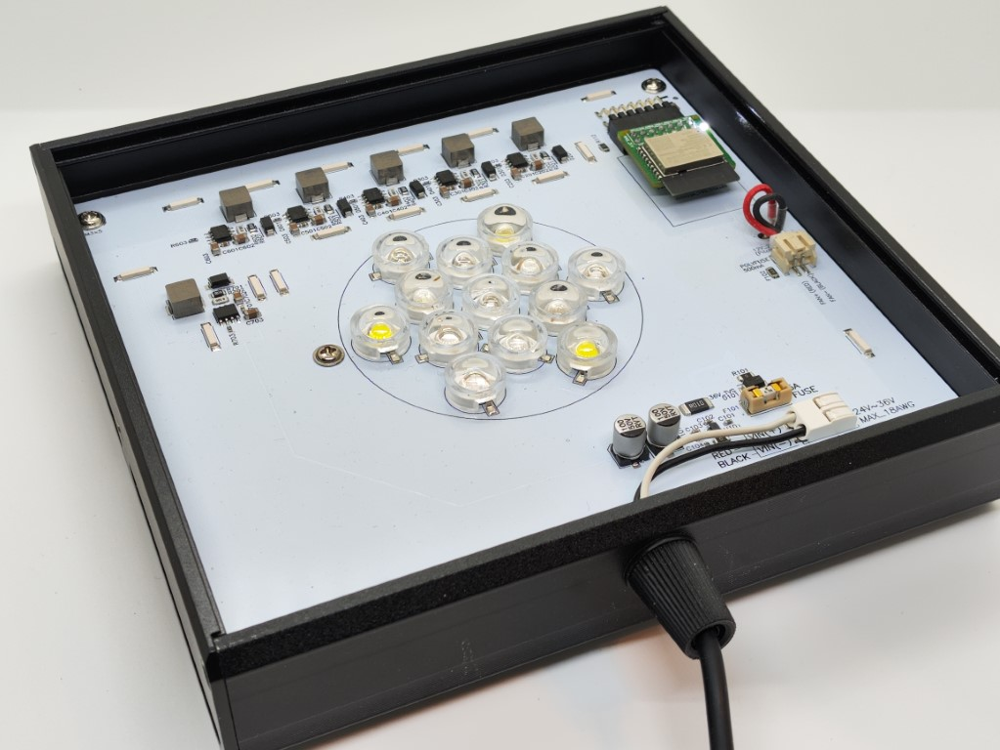

# BorneoIoT: Professional Aquarium Lighting Platform

        <a href="https://www.borneoiot.com"><b>Website</b></a> •
        <a href="https://docs.borneoiot.com"><b>Documentation</b></a> •
        <a href="https://github.com/borneo-iot/borneo/discussions"><b>Forum</b></a> •
        <a href="https://discord.gg/EFJTm7PpEs"><b>Discord</b></a> •
        <a href="https://flasher.borneoiot.com"><b>Web Firmware Flasher</b></a>

    
    &nbsp;
    

> **Production-grade open-source stack for aquarium LED dimmers.**
> Hardware designs, embedded firmware, and mobile controls. Ready for weekend builds or product integration.

This project delivers a full-stack solution for smart aquarium LED:

1.  **Hardware**: Certified open-source PCB designs targeting the ESP32 family, featuring 6-channel PWM dimming and modular architecture.
2.  **Firmware**: A robust ESP-IDF based firmware implementing CoAP/CBOR protocols, sunrise/sunset simulation, and cooling control.
3.  **Mobile App**: A cross-platform Flutter application for intuitive real-time control, scheduling, and device management.

## Quick Start

**New users:** Follow the **[step-by-step guide](https://docs.borneoiot.com/getting-started/quick-start.html)** to flash firmware and connect your first device.

**No toolchain required**, flash directly from Chrome/Edge Browser:

1. Connect ESP32/ESP32-C3/ESP32-C5 via USB
2. Visit **[flasher.borneoiot.com](https://flasher.borneoiot.com)**
3. Download the app and power on

[Full Getting Started Guide](https://docs.borneoiot.com/getting-started)

## Features

### Hardware

- **6 or 10 PWM channels**, 12-bit resolution (4096 steps), up to 19kHz
- **Flicker-free**, suitable for aquarium photography
- **22×30mm core module**, fits slim LED fixtures
- ESP32-C3/C5 native, WiFi + Bluetooth LE

[Schematics & BoM](hw/)

### Firmware

- **Sunrise/sunset curves** with millisecond-smooth transitions
- **SNTP time sync**: automatic, no manual adjustment
- **Active cooling control**: temperature-based fan/PWM throttling
- **OTA updates**: over-the-air firmware upgrades
- **CoAP + CBOR protocol**: efficient, low-latency device communication

[Source code](fw/) • [Protocol docs](https://docs.borneoiot.com/protocol)

### Mobile App

- **Cross-platform**: iOS, Android, Windows, built with Flutter
- **Real-time control**: dimming, scheduling, scene presets
- **Multi-device**: group control, cloud-free local network
- **Developer API**: Python client for automation

[App source](client/) • [Python SDK](borneopy/)

## Repository Guide

| Directory | Contents | Entry Point |
|-----------|----------|-------------|
| [`hw/`](hw/) | PCB designs (Horizon EDA), Gerbers, 3D models | [`hw/README.md`](hw/) |
| [`fw/`](fw/) | ESP-IDF firmware, CoAP protocol | [`fw/README.md`](fw/) |
| [`client/`](client/) | Flutter mobile app | [`client/README.md`](client/) |
| [`borneopy/`](borneopy/) | Python client library | [`borneopy/README.md`](borneopy/) |

## Getting Started

- **New Users**: Check out our [**Quick Start Guide**](https://docs.borneoiot.com/getting-started/quick-start.html).
- If you are a new user looking to quickly experience our firmware, you can directly use our web firmware flasher to flash the latest version of the firmware to your ESP32 series development board: https://flasher.borneoiot.com/
- **Hardware**: Find schematics and BoM files in the [`hw/`](hw/) directory.
- **Firmware**: Compilation instructions are available in the [`fw/`](fw/) folder.

## Project Status

| Component | Status | Details |
| :--- | :--- | :--- |
| **Hardware** | Stable | Production-ready, OSHWA certified. |
| **Firmware** | Beta | Full-featured and stable on my personal tanks for years. |
| **Mobile App** | Beta | Core functionality working. |

## Roadmap

Check our [milestones](https://github.com/borneo-iot/borneo/milestones) for the latest development updates and upcoming features.

## Community & Support

- **Website**: [www.borneoiot.com](https://www.borneoiot.com)
- **Documentation**: [docs.borneoiot.com](https://docs.borneoiot.com)
- **Discussions**: [Join the Conversation](https://github.com/borneo-iot/borneo/discussions)
- **Discord**: [Connect with Developers](https://discord.gg/EFJTm7PpEs)
- **Email**: [info@binarystarstech.com](mailto:info@binarystarstech.com)

## Licenses

- **Software/Firmware**: Dual-licensed under [**GPL-3.0+**](LICENSE) and Enterprise licenses.
- **Hardware**: Licensed under [**CERN-OHL-S-2.0**](LICENSE-HARDWARE).

---

The hardware, firmware, and App for this project were all created by: Wei Li（李维）.