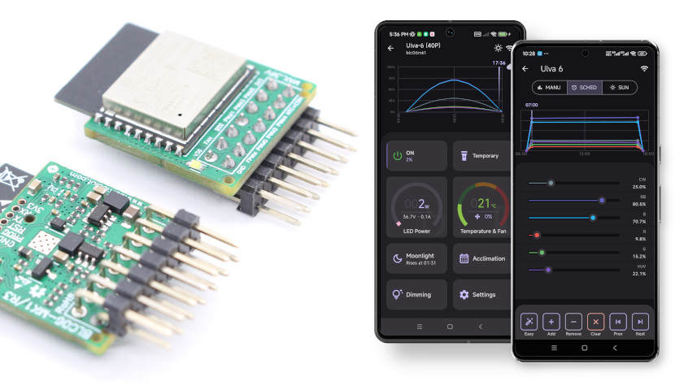

# BorneoIoT: A State-of-the-Art Full-Stack Open-Source Aquarium LED WiFi Dimmer

        <a href="https://www.borneoiot.com"><b>Website</b></a> •
        <a href="https://docs.borneoiot.com"><b>Documentation</b></a> •
        <a href="https://github.com/borneo-iot/borneo/discussions"><b>Forum</b></a> •
        <a href="https://discord.gg/EFJTm7PpEs"><b>Discord</b></a> •
        <a href="https://flasher.borneoiot.com"><b>Web Firmware Flasher</b></a>

    

---

**Borneo-IoT** is a professional-grade, modular open-source smart aquarium platform designed for aquarium enthusiasts and DIYers. It provides a complete end-to-end solution—from hardware schematics to embedded firmware and a modern mobile app—to build and control high-performance aquarium LED lighting systems.

## One System, Three Pillars

This project delivers a full-stack solution for smart aquarium LED:

1.  **Hardware**: Certified open-source PCB designs targeting the ESP32 family, featuring 6-channel PWM dimming and modular architecture.
2.  **Firmware**: A robust ESP-IDF based firmware implementing CoAP/CBOR protocols, sunrise/sunset simulation, and cooling control.
3.  **Mobile App**: A cross-platform Flutter application for intuitive real-time control, scheduling, and device management.

---

## ️Key Features

### Powerful Hardware
- **OSHWA Certified**: Pro-grade designs (Model BLC06MK1) using [Horizon EDA](https://horizon-eda.org).
  
- **High Performance**: Optimized for ESP32/ESP32-C3/C5 with unified board definitions.
- **Precision Dimming**: 6-channel PWM with smooth 12-bit resolution and soft-start technology.
- **Expandable**: Reference designs for LED lamps, drivers, and even dosing pumps.

### Intelligent Firmware
- **Dynamic Control**: Graphical sunrise/sunset curves with millisecond-smooth transitions.
- **Reliable**: SNTP time synchronization and PID-controlled active cooling system.
- **Production Ready**: Full support for over-the-air (OTA) updates and automated QA testing.[^1]
- **Extensible Architecture**: Zephyr-inspired driver abstraction for easy porting and expansion.

### Modern Control
- **Cross-Platform**: Modern UI built with Flutter for iOS, Android, and beyond.
- **Unified Protocol**: Uses CoAP + CBOR for efficient, low-latency device communication.
- **Developer Friendly**: Includes a Python API client for custom automation scripts.

---

## Repository Structure

| Directory | Content | Description |
| :--- | :--- | :--- |
| [**`hw/`**](hw/) | **Hardware** | PCB designs (Horizon EDA), 3D models, and PDF schematics.[^2] |
| [**`fw/`**](fw/) | **Firmware** | ESP-IDF source code for LED dimmers and upcoming devices. |
| [**`client/`**](client/) | **Mobile App** | Flutter source code for the cross-platform mobile application. |
| [**`borneopy/`**](borneopy/) | **Python SDK** | Python client library for desktop control and scripting. |

---

[^1]: The open-source project does not provide mass production-related fixtures or specialized factory software.
[^2]: PDF datasheets are provided; however, raw template source files for some documents are excluded.

## Getting Started

- **New Users**: Check out our [**Getting Started Guide**](https://docs.borneoiot.com/getting-started).
- If you are a new user looking to quickly experience our firmware, you can directly use our web firmware flasher to flash the latest version of the firmware to your ESP32 series development board: https://flasher.borneoiot.com/
- **Hardware**: Find schematics and BoM files in the [`hw/`](hw/) directory.
- **Firmware**: Compilation instructions are available in the [`fw/`](fw/) folder.

---

## Project Status

| Component | Status | Details |
| :--- | :--- | :--- |
| **Hardware** | Stable | Production-ready, OSHWA certified. |
| **Firmware** | Beta | Full-featured and stable on my personal tanks for years. |
| **Mobile App** | Beta | Core functionality working. |

---

## Roadmap

Check our [milestones](https://github.com/borneo-iot/borneo/milestones) for the latest development updates and upcoming features.

## Community & Support

- **Website**: [www.borneoiot.com](https://www.borneoiot.com)
- **Documentation**: [docs.borneoiot.com](https://docs.borneoiot.com)
- **Discussions**: [Join the Conversation](https://github.com/borneo-iot/borneo/discussions)
- **Discord**: [Connect with Developers](https://discord.gg/EFJTm7PpEs)
- **Email**: [info@binarystarstech.com](mailto:info@binarystarstech.com)

---

## Licenses

- **Software/Firmware**: Dual-licensed under [**GPL-3.0+**](LICENSE) and Enterprise licenses.
- **Hardware**: Licensed under [**CERN-OHL-S-2.0**](LICENSE-HARDWARE).

---

The hardware, firmware, and App for this project were all created by: Wei Li（李维）.